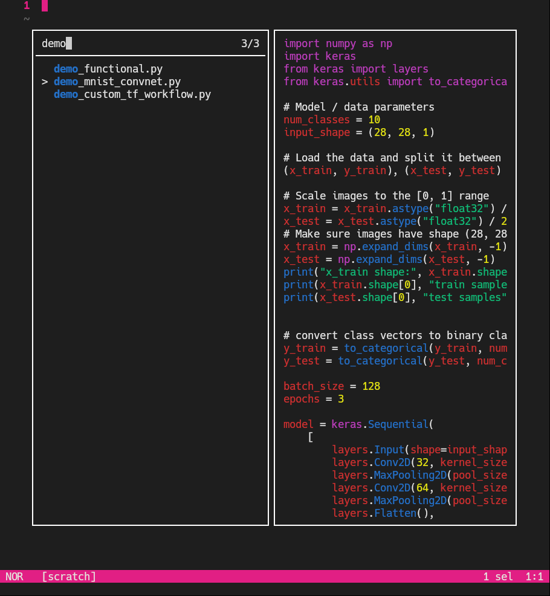

### [Helix](https://github.com/helix-editor/helix) editor dark theme inspired by the [Unger](https://github.com/fernandounger/Unger-Theme) VSCode theme.

<p align="center">
  
&nbsp; &nbsp; &nbsp; &nbsp;
  
</p>

### Installation
1. copy the `unger.toml` file to the your helix themes folder `~/.config/helix/themes`.
2. edit the helix config file (`~/.config/helix/config.toml`) to change the default theme
    ``` toml
    theme = "unger"
    ```
3. reload the config to apply the changes - `config-reload` command inside the editor.

### License

[MIT © License](https://github.com/arthursfares/helix-unger-theme/blob/main/LICENSE)

### Many thanks to the creator of the orignal Unger VSCode theme

<table>
    <td align="center">
      <a href="https://github.com/fernandounger/">
        <br>
          </a>
        <sub>
          <b>Fernando Unger</b>
        </sub>
    </td>
</table>